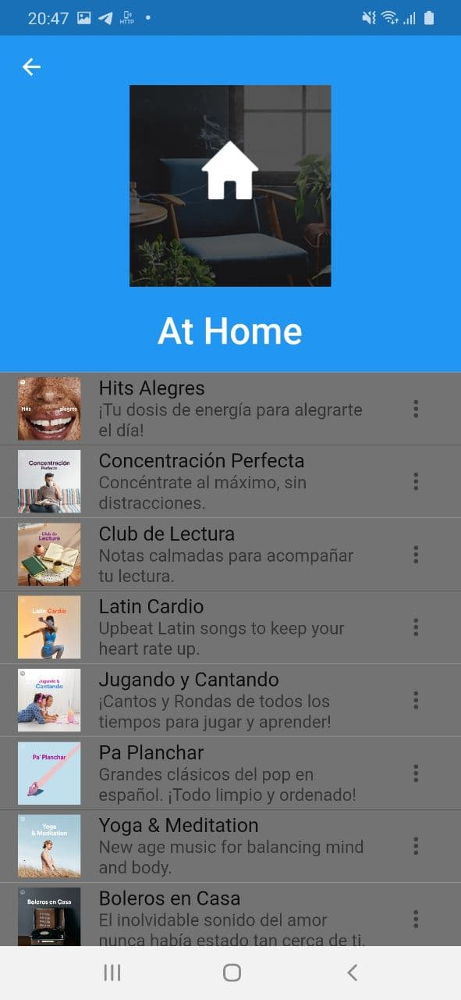
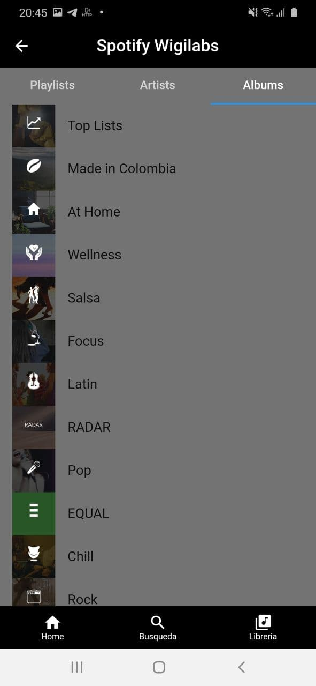
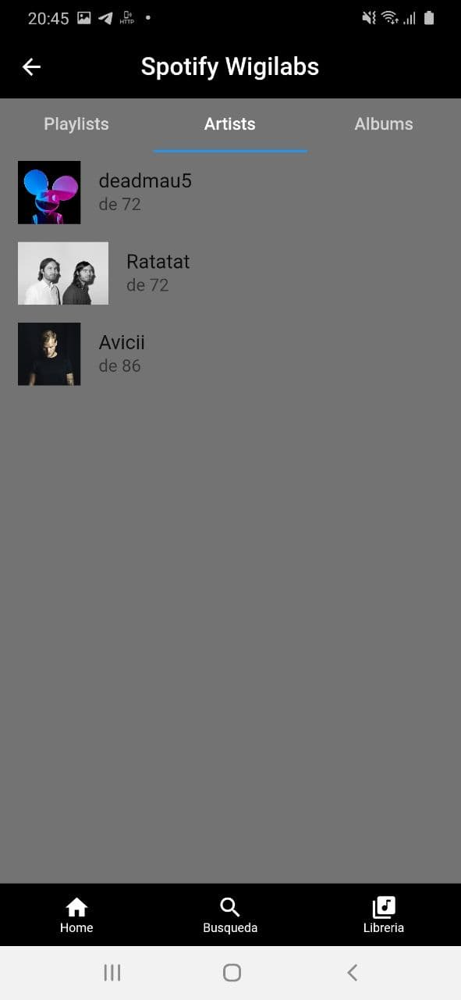
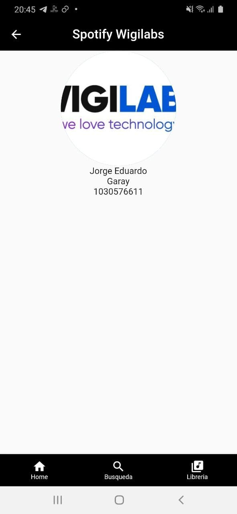
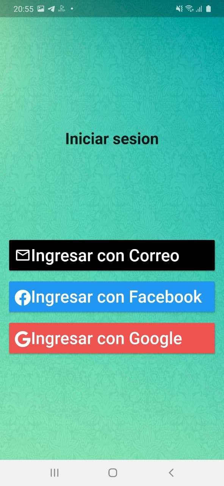

# spotify wigilabs
ESta es una aplicacion construida en flutter la cual consume los siguientes servicios:

1. Contiene un login implementado con Firebase ( Facebook, Google,  Email).
2. Consume los servicios de spotify ( playlis, albunes, etc...)
3. Utiliza patrones de desarrollo se utilizarojn BLOC y PROVIDER.
4. Tiene prefrencias compartidas, para un logeo unico.

Finalmente esta app es realizada solo para fines demostrativos.

# Información Personal

# Screenshots

**Nombre**: Jeisson Santacruz.
**Profesion **: Ingeniero de sistemas y ciencias de la computacion.
** Tecnologias** : Flutter, React Native, PHP, Node js, JavaScript, Mongo Db.
** Contacto** : jeissonsanta132@gmail.com

#  ¿Por qué Flutter?

Como desarrollador movíl, he tenido la posibilidad de dasarrollar nativamente ( swift, xamarin), y no hay ningun lenguaje que pueda hacer lo que hace dart.
Primero, al tener widgets predefinidos, hace que se pueda desarrollar muchos más rapido ya que no se tiene que pensar mucho en la construccion de estos. Además,  Flutter tiene  widgets especiales para ambas plataformas (iOs,Android) lo cual hace que la aplicación quede totalmente armonica para ambas plataformas. Finalmente , al compilar nativamente para iOs y Android genera un rendimiento gigantesco para ambas  plataformas.

Cabe resalatar sus herramientas, como el Hot Reload, los break point para debug y pruebas.

